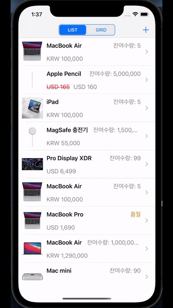
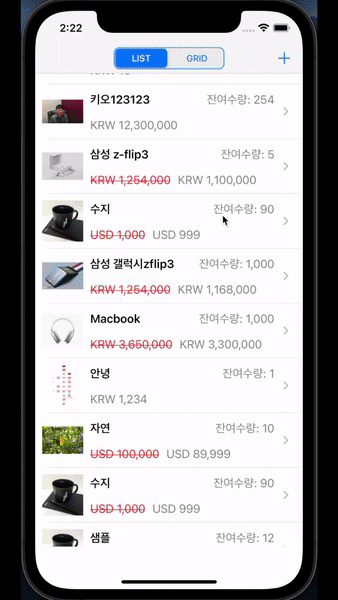
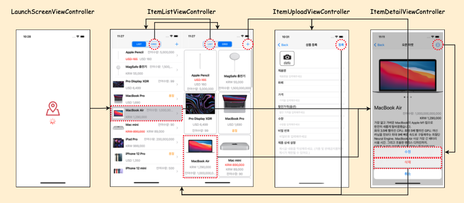
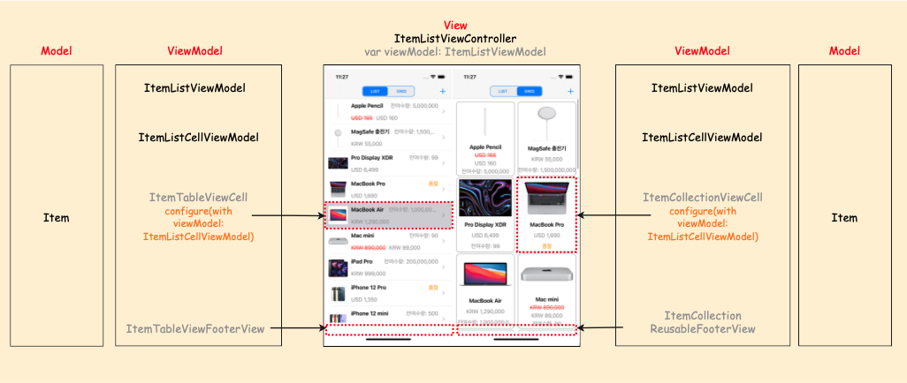
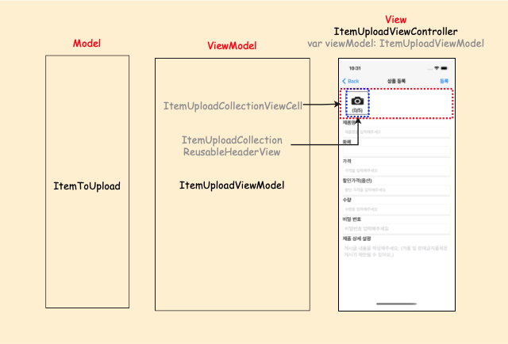
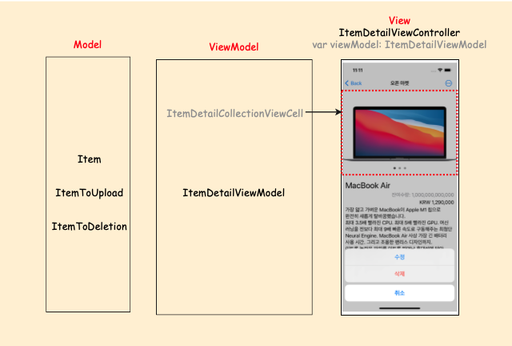
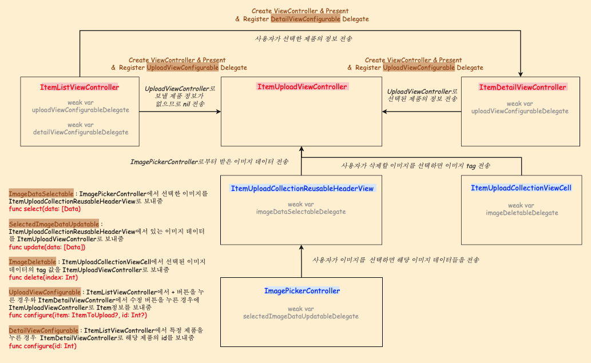
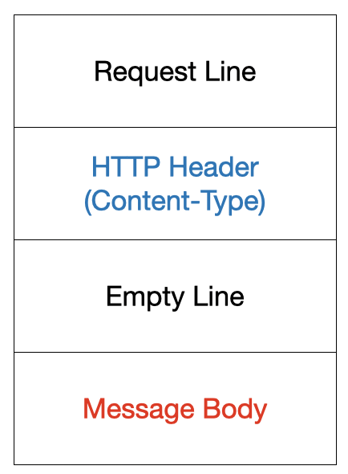

# OpenMarketApp

> 서버로부터 데이터를 받아와서 상품을 보여주고 등록 수정 및 삭제를 할 수 있는 당근마켓🥕 같은 앱 구현하기


## Index

- [기능](#기능)
- [설계 및 구현](#설계-및-구현)
- [Trouble shooting](#Trouble-shooting)
- [관련 학습 내용](#관련-학습-내용)

<p>
  
  
</p>

<br>

## 기능

- [상품 목록](#상품-목록)
- [상품 상세 정보](#상품-상세-정보)
- [상품 등록](#상품-등록)
- [상품 수정](#상품-수정)
- [상품 삭제](#상품-삭제)
- [추가 기능](#추가-기능)

### 상품 목록

> 서버로부터 상품 목록을 받아오며 LIST, GRID 형태를 선택하여 볼 수 있다. 
>
> 또한 스크롤을 아래로 내려서 서버에 등록된 상품들을 확인할 수 있다.

<p>
   <br clear="left"/>
</p>

<br>

### 상품 상세 정보

>  LIST, GRID 상태에서 상품을 선택하면 상품에 대한 상세 정보를 확인할 수 있다. (왼쪽: LIST / 오른쪽: GRID)

<p>
  
  
</p>

<br>

### 상품 등록

> 사용자로부터 입력 사항들을 입력 받고, 등록 버튼을 눌렀을 때 필수 입력 사항들이 입력되지 않으면 요구한다. 
>
> 전부 입력된 경우에는 등록 완료 창이 뜬다.

<p>
   <br clear="left"/>
</p>

<br>

### 상품 수정

> 필수 입력 사항들이 전부 입력되고 비밀번호가 일치하는 경우에는 수정 완료 창이 뜬다. (왼쪽) 
>
> 비밀번호가 일치하지 않는 경우에는 비밀번호가 달라서 수정할 수 없다는 창이 뜬다. (오른쪽)

<p>
  
  
</p>

<br>

### 상품 삭제

> 비밀번호가 일치하는 경우에는 삭제 완료 창이 뜬다. (왼쪽)
>
> 비밀번호가 일치하지 않는 경우에는 비밀번호가 달라서 삭제할 수 없다는 창이 뜬다. (오른쪽)

<p>
  
  
</p>

<br>

### 추가 기능 

> OpenMarketApp 시작할 때 loading animation 화면 구현
>
> 서버로부터 이미지를 받아올 때, 사용자에게 데이터를 받아온다는 것을 더욱 반응적으로 알려주기 위해서 skeleton view 적용
>
> 사용자가 원하는 경우에는 데이터를 refresh 가능

<p>
   <br clear="left"/>
</p>

<br>

## 설계 및 구현

### ViewController 구성



- `LaunchScreenViewController` : LaunchScreen 이후에 **Loading Animation을 보여주기 위한** ViewController
- `ItemListViewController` : **LIST, GRID 형태**로 볼 수 있으며 **서버로부터 상품 데이터를 받아와서 보여주는** ViewController
- `ItemUploadViewController` : **상품을 등록**할 수 있는 ViewController 
- `ItemDetailViewController` : ItemListViewController에서 특정 상품을 선택하면 **상세 정보를 보여주며**, 오른쪽 위의 버튼을 누르면 **상품을 수정하거나 삭제**할 수 있는 ViewController

<br>

### MVVM DesignPattern 적용

##### ItemListViewController & ItemListViewModel - MVVM



- `Item` : 서버에서 데이터를 받아올 수 있는 **Decodable을 채택한 Model**
- `ItemListViewModel` : 실제로 서버에서 데이터를 받아와서 **Observable property**인 `itemList`에 값을 추가해서 ItemListViewController의 itemTableView, itemCollectionView에 사용되는 데이터를 가지고 있는 **ViewModel**
- `ItemListCellViewModel` : ItemTableViewCell, ItemTableViewFooterView, ItemCollectionViewCell, ItemCollectionReusableFooterView와 같이 **실제로 사용자에게 보여지는 모습으로 Model인 Item 타입의 데이터를 가공하는 ViewModel**
- `ItemListViewController` : ItemTableView, ItemCollectionView를 가지고 있고, ItemListViewModel 타입인 `viewModel` property를 가지고 있으며, viewModel의 `itemList` 의 값이 변할 때 마다 화면도 그에 맞게 업데이트를 하게 된다.
- `Observable` : 제네릭 클래스이며 **관찰하고 싶은 대상에 대해서 ViewModel에서 Observable type으로 선언**한 뒤, **값이 바뀌었을 때 처리에 대해서 View에서 bind를 작성**해주면 된다. 

##### ItemUploadViewController & ItemUploadViewModel - MVVM

 <br clear="left"/>

- `ItemToUpload` : 서버에 데이터를 업로드 할 수 있는 **Encodable을 채택한 Model**
- `ItemUploadViewModel` : **사용자의 사진 선택과, 상품에 대한 내용들을 제대로 입력했는지 확인**하기 위한 Observable property들과, ItemDetailViewController에서 **수정 버튼을 클릭하여 온 경우에 기존의 값들을 화면에 표시해주기 위한** Observable property를 가지고 있다. 또한 실제로 상품을 HTTP Method인 **POST, PATCH를 하는 메서드**를 가지고 있다.
- `ItemUploadCollectionViewCell` : 사용자가 사진을 선택했을 때, 선택한 사진들을 보여주기 위해서 CollectionView를 사용하고 이때 Custom Cell로서 사용된다.
- `ItemUploadCollectionReusableHeaderView` : collectionView의 headerView로 사진 선택을 할 수 있는 버튼을 넣어준다.
- `ItemUploadViewController` : ImageCollectionView를 가지고 있으며, ItemUploadViewModel 타입인 `viewModel` property를 가지고 있다. viewModel의 Observable property 값들이 변할 때 마다 **bind 메서드에서 처리한 대로 화면도 업데이트 된다.** `ItemListViewController `에서 + 버튼을 통해서 들어오는 경우와 `ItemDetailViewController` 에서 수정 버튼을 통해서 들어오는 경우에 네비게이션 바와 버튼의 타이틀이 다르고, 서버로의 데이터 전송 방법이 POST, PATCH로 다르다.

##### ItemDetailViewController & ItemDetailViewModel - MVVM

 <br clear="left"/>

- `Item` : 상세 정보를 보여주기 위해서 **Decodable을 채택한 Model**
- `ItemToUpload` : **수정**을 선택하는 경우에는 사용하는 **Encodable을 채택한 Model** 
- `ItemToDeletion` : **삭제**를 선택하는 경우 사용하는 **Encodable을 채택한 Model** 
- `ItemDetailViewModel` : **서버로부터 상품의 정보를 받아서 화면에 보여주기 위한** Observable property들을 가지고 있다. 또한 서버로부터 **데이터를 받아오고, 삭제 요청을 보내는 메서드**를 가지고 있다.
- `ItemDetailCollectionViewCell` : 상품 이미지들이 여러 개인 경우에는 collectionView와 page control을 사용해서 좌/우로 스크롤하여 이미지를 확인할 수 있다. 
- `ItemDetailViewController` : ImageCollectionView를 가지고 있으며, ItemDetailViewModel 타입인 `viewModel` property를 가지고 있다. viewModel의 Observable property들의 값에 변화가 있을 때, **bind 메서드에 의해서 처리한대로 화면이 업데이트 된다.** 

<br>

### View간의 Data 전송 - Delegate 사용



ViewController와 ViewController, View 간의 데이터를 backward로 받기 위해서 delegate protocol을 구현하여 사용하였다. 

<br>

### 역할 분배

#### view 관련

| class                        | 역할                                                         |
| :--------------------------- | :----------------------------------------------------------- |
| `LaunchScreenViewController` | LaunchScreen 이후에 Loading animation을 보여주고, `ItemListViewController` 로 화면 전환 |
| `ItemListViewController`     | - LIST, GRID 형태로 상품들을 볼 수 있다 <br>- 내비게이션 오른쪽 + 버튼을 눌러서 상품을 등록할 수 있다 <br>- 상품을 눌러서 상품의 상세 정보를 볼 수 있다 |
| `ItemUploadViewController`   | - `ItemListViewController` 에서 + 버튼을 눌러서 상품 등록 화면으로 올 수 있다 <br>- `ItemDetailViewController` 에서 수정 버튼을 눌러서 상품 등록 화면으로 올 수 있다 <br>- **+ 버튼**으로 들어오면 모든 정보 새롭게 입력, **수정 버튼**으로 들어오면 기존의 정보가 입력되어져 있다 <br>- 상품의 정보를 입력하고 등록할 수 있다 |
| `ItemDetailViewController`   | - `ItemListViewController` 에서 상품을 눌러서 상세 정보 화면으로 올 수 있다 <br>- 등록된 사진이 여러 장이면 좌/우로 스크롤해서 볼 수 있다 <br>- 내비게이션 오른쪽 버튼을 눌러서 상품을 수정하거나 삭제할 수 있다 <br>- 수정을 누르면 `ItemUploadViewController` 로 이동한다 <br>- 삭제를 누르면 사용자로부터 비밀번호를 입력받고 일치하면 상품을 삭제한다 |
| `ItemListViewModel`          | - 서버에서 page에 맞는 ItemList를 fetch하는 메서드가 있고, 결과를 Observable property에 Item 형태로 저장한다 <br>- paging과 관련된 property를 가지고 있다 |
| `ItemListCellViewModel`      | - 네트워킹을 통해 받아온 Item 타입의 데이터를 실제 화면에 보여지는 값으로 가공한다 |
| `ItemUploadViewModel`        | - `ItemListViewController` 로부터 오는 경우에는 **비어있는 화면을 제공**한다 <br>- `ItemListViewController` 로부터 오는 경우에는 상품을 HTTP Method 중에서 **POST**로 보낸다 <br>- `ItemDetailViewController` 로부터 오는 경우에는 **기존의 상품의 정보를 화면에 제공**한다 <br>- `ItemDetailViewController` 로부터 오는 경우에는 변경된 부분만 HTTP Method 중에서 **PATCH**로 보낸다 <br>- 두 경우 모두 사용자의 **입력에 대한 조건을 검사**하고 만족하지 않는 경우 **error message와 함께 빨간색으로 표시**해준다 |
| `ItemDetailViewModel`        | - `ItemListViewController` 로부터 사용자가 선택하는 경우 **해당 Item 정보를 네트워킹을 통해 받아와서 제공**한다 <br>- 수정 버튼을 누르는 경우 **ItemToUpload 타입으로 Item 정보를 변환해주는 함수**를 가진다 <br>- 삭제 버튼을 누르는 경우 ItemToDeletion 타입을 생성하여 **DELETE를 요청**한다. |
| `Observable`                 | - ViewModel의 데이터들 중에서 관찰이 필요한 데이터 타입에 observer 기능을 구현하기 위한 제네릭 타입 클래스 <br>- ViewModel에서 Observable 프로퍼티들은 ViewController에서 bind 메서드를 통해서 변화가 있을 때 처리를 구현해준다 |

#### Network 관련

| class/struct/enum       | 역할                                                         |
| :---------------------- | :----------------------------------------------------------- |
| `APIRequest`            | - makeRequest(), parseResponse() 함수를 가지는 protocol      |
| `APIReqeustLoader`      | - `APIRequest` protocol 채택 <br>- `URLSession`을 생성자를 통해서 설정할 수 있다 <br>- loadAPIRequest() 라는 네트워킹을 하는 메서드를 가진다 |
| `HTTPMethod`            | - HTTP Method를 가지는 enum                                  |
| `OpenMarketAPI`         | - OpenMarketAPI baseURL 가지는 enum                          |
| `GetItemListAPIRequest` | - `APIReqeust` protocol 채택하며 ItemList에 대해서 GET 요청 시 사용 |
| `GetItemAPIRequest`     | - `APIReqeust` protocol 채택하며 Item에 대해서 GET 요청 시 사용 |
| `GetImageAPIRequest`    | - `APIReqeust` protocol 채택하며 Image데이터에 대해서 GET 요청 시 사용 |
| `PostItemAPIRequest`    | - `APIReqeust` protocol 채택하며 POST 요청 시 사용           |
| `PatchItemAPIRequest`   | - `APIReqeust` protocol 채택하며 PATCH 요청 시 사용          |
| `DeleteItemAPIRequest`  | - `APIReqeust` protocol 채택하며 DELETE 요청 시 사용         |

#### Error 관련

| enum/protocol     | 역할                                                      |
| :---------------- | :-------------------------------------------------------- |
| `OpenMarketError` | OpenMarketApp 내부에서 발생하는 Error들을 정의한 enum     |
| `AlertString`     | Alert를 보여줄 때 사용되는 String을 정의한 enum           |
| `AlertShowable`   | Alert를 보여주어야하는 ViewController가 채택하는 protocol |

#### Utilities

| class/struct/enum       | 역할                                                         |
| :---------------------- | :----------------------------------------------------------- |
| `CustomNumberFormatter` | ViewModel에서 View에 보여질 때 수량, 금액 등에 대해서 자리수에 따른 콤마(,)를 넣기 위한 struct |
| `OpenMarketViewString`  | OpenMarket 앱 내부의 View들에서 보여지는 String들을 정의한 enum <br>(ItemListViewString, ItemUploadViewString, ItemDetailViewString) |
| `ImageCacheManager`     | **이미지 캐싱을 위해서 사용하는 singleton class**            |
| `ISO4217_CurrencyCode`  | ISO4217; 통화의 이름을 정의하기 위한 통화의 종류를 가지는 enum |

<br>

### SkeletionView
> SkeletonView third-party 라이브러리 사용
<details>
  <summary> SkeletonView 사용 이유 및 방법 </summary>

  <br>

  `Skeleton View` : Loading 되는 동안의 실제로 보여질 View와 비슷한 형태의 View를 의미

- `사용 이유` : 사용자가 데이터가 로딩되는 동안에 빈 페이지를 보여주는 것보다 skeletion view를 통해 로딩되고 있다는 것을 보여주면 **App이 더 반응적이고 빠르다고 느끼기 때문에 사용**한다. 또한 기존의 loading spinner보다는 **컨텐츠의 대략적인 형태를 보여주기 때문에** 사용자로 하여금 App이 진행되고 있다고 느끼게 한다. 
- `사용 방법` : [SkeletionView 라이브러리](https://github.com/Juanpe/SkeletonView) 를 사용
  - `UITableView` 에 적용하므로, 기존의 `UITableViewDatasource` 대신에 `SkeletonTableViewDataSource` 를 채택하여 구현
  - Storyboard 와 코드로 구현된 View들 중에서 SkeletionView를 적용할 View에 `isSkeletonable` 속성을  true로 설정
  - 보여질 시점과 사라질 시점에서 SkeletonView를 보여주고 숨기는 메서드 호출
- `고려할 만한 사항`
  - `SkeletionView 사용할 화면` : OpenMarketApp에서는 맨 처음 데이터를 받아와서 보여주는 화면에서의 로딩이 있을 수 있기 때문에 해당 화면에만 SkeletionView를 적용
  - `SkeletionView가 매번 보여져야하는가에 대한 고민` : 맨 처음 이후에 데이터를 다시 받아오거나 할 때는 SkeletionView를 사용하지 않았습니다. 그 이유는 맨 처음에 앱에 들어왔을 때에는 어떠한 컨텐츠가 나올지 모르기 때문에 컨텐츠의 형태를 예상할 수 있는 SkeletionView를 사용하는 것이 사용성을 높여줄 수 있다고 생각합니다. 그러나 앱을 사용하는 도중에 데이터를 다시 다운 받는 경우에는 컨텐츠가 어떠한 형태인지 이미 알고 있기 때문에 굳이 SkeletionView를 사용하여 기존의 데이터들을 가리지 않고, indicator를 사용하여 로딩중임을 표시하도록 하였습니다.   
  </details>

<br>

### Pagination(=Paging)
> ScrollViewDidScroll() 메서드 사용

<details>
  <summary> Pagination 사용 이유 및 방법  </summary>

  <br>

  - `사용 이유` : tableview나 collectionview를 사용할 때, 서버에서 많은 리스트 데이터를 받아올 때 한 번에 모든 데이터를 받아오면 기기와 서버에게 부담이 되므로 일정량의 리스트 데이터만 보내주고 스크롤을 내렸을 때 추가로 리스트 데이터를 보내주기 위해서 사용

- `구현 방법` : `ScrollYOffset` 을 활용하여 구현

  - 1️⃣ scrollView의 `contentOffset.y` 구하기 <br>`contentOffset.y` = scroll이 되기 전 scrollview의 scrollview.frame.size.height를 기준으로 화면에서의 scrollview의 y 좌표

  - 2️⃣ scrollView의 `contentSize.height` 구하기 <br>`contentSize.height` = scrollView 내 content의 크기 (현재 tableview에 들어있는 cell들의 개수에 따른 높이)

  - 3️⃣ scrollView의 `frame.height` 구하기 <br>
    `frame.height` = 화면의 세로 높이

  - 1️⃣ > 2️⃣ - 3️⃣ 조건을 만족하는 경우에 paging 수행

</details>

<br>

### 이미지 여러 장 선택하기

> BSImagePicker third-party 라이브러리 사용

<details>
  <summary> BSImagePicker 사용 이유 및 방법  </summary>

  <br>

`BSImagePicker` : iOS에서 여러 장의 사진을 선택하기 위해서 사용하는 서드파티 [라이브러리](https://github.com/mikaoj/BSImagePicker)

- `사용 이유` : Swift에서는 `UIImagePickerController` 를 제공하여 이미지를 선택할 수 있다. 그러나 `UIImagePickerController` 에서 여러 장을 선택하는 방법은 이미지를 한 장씩 여러 번 선택해야했다. 이는 여러 장의 사진을 선택할 때 매번 `UIImagePickerController` 를 띄우는 것은 비효율적이라고 생각했다. 검색 결과 iOS14 이상에서부터는 적용가능한 `PHPickerViewController` 가 있지만 iOS 14 이상에서만 사용가능해서 외부 라이브러리를 사용하기로 결정했다. 
- `기능` : 여러 장 선택 / 전체화면 preview / 앨범 전환 / images, Live Photo, video 선택 가능 
- `사용 방법` 
  - Cocoapods에 `BSImagePicker` 추가
  - `Info.plist` 에서 사진 라이브러리 사용 권한 요청 작성
  - `BSImagePicker` 를 import 하고, `ImagePickerController` 생성
  - `presentImagePicker()` 메서드에서 finished 부분 구현 <br> 이때 이미지는 `PHAsset` 타입이므로, 이를 `UIImage` 타입으로 변환하기 위해서 `PHImageManager` 사용

</details>

<br>

### 통화 종류 선택하기
> PickerView를 사용

<details>
  <summary> PickerView 사용 이유 및 방법  </summary>

  <br>

`PickerView` :  사용자가 하나 이상의 선택지 가운데 하나를 선택해야하는 경우 사용하는 view

- `사용 이유` : OpenMarketApp 내부에서 사용자가 **상품을 등록하거나, 수정하는 화면에서 통화를 선택할 때** pickerview를 사용하였다. 이유는 통화의 경우에는 서버에서 ISO4217를 따르기 때문에 정해진 통화 문자열을 서버로 전송해야한다. 그러나 **사용자가 ISO4217에 해당하는 통화명을 모를 수 있기 때문에** 실제로 사용하는 통화의 이름을 영어로 표기하고, 해당 통화를 선택했을 때 ISO4217에 대응하는 통화명이 반환되도록 구현하였다.
- `사용 방법` 
  - ISO4217을 따르는 통화의 종류를 enum으로 생성
  - `UIPickerView` 를 `UITextfield` 의 inputView로 정의
  - pickerView의 delegate, dataSource를 설정하고 필요한 메서드를 구현

</details>

<br>

### Page Control 사용해서 이미지 넘기기
> CollectionView & PageControl 사용해서 구현

<details>
  <summary> PageControl 사용한 부분 및 방법  </summary>

  <br>

`PageControl` : 페이징을 하는 화면이 있을 때, 페이지를 표시하는 수평으로 이뤄진 점들을 표시하는 컨트롤

- `사용 부분` : 상품 상세 정보 화면에서 여러 개의 이미지가 있을 때 이를 좌/우로 스크롤 할 때 페이지를 표시하기 위해서 사용
- `사용 방법` 
  - pageControl을 View에 생성
  - collectionView에서 가로로 스크롤을 하는데 이때 pageControl을 사용하므로 `showHorizontalScrollIndicator` 을 false 설정
  - collectionView의 `isPagingEnable` 을 true로 설정
  - `scrollViewDidScroll` 함수에서 pageControl의 `currentPage` 를 설정하는 로직 작성

</details>

<br>

## Trouble shooting

1️⃣ [단위 테스트 가능하도록 모델 및 네트워킹 담당 타입의 구현](#단위-테스트-가능하도록-모델-및-네트워킹-담당-타입의-구현)

2️⃣ [시작 화면에서 애니메이션 넣기](#시작-화면에서-애니메이션-넣기)

3️⃣ [ItemListViewController에서 tableview와 collectionview에서 스크롤의 버벅임과 이미지가 제대로 들어가지 않는 문제](#ItemListViewController에서-tableview와-collectionview에서-스크롤의-버벅임과-이미지가-제대로-들어가지-않는-문제)

4️⃣ [이미지 한 번에 여러 개 선택하는 방법](#이미지-한-번에-여러-개-선택하는-방법)

5️⃣ [ItemListViewController에서의 새로운 데이터를 받아와서 reload하는 경우](#ItemListViewController에서의-새로운-데이터를-받아와서-reload하는-경우)

<br>

### 단위 테스트 가능하도록 모델 및 네트워킹 담당 타입의 구현

- 문제 상황

  - **네트워크 없이도 테스트가 가능하도록 네트워킹 타입을 구현**하고 싶었다. 그리고 지난 프로젝트에서는 네트워킹 타입을 Singleton을 사용해서 내부에 모든 fetch, patch, post, delete와 같은 메서드를 가지도록 구현했었는데, singleton을 사용하게 되면 앱 내부에서 계속해서 메모리를 차지하고 있기 때문에 이러한 방법보다는 **네트워킹이 필요할 때마다 생성하여 사용**할 수 있는 방법을 고민해보게 되었다. 또한 API가 추가되었을 때 **SOLID의 OCP에 따라서 기존의 파일이나, 코드를 수정하지 않고 사용할 수 있도록 구현**하려고 노력해보았다. 

- 해결 방법

  - 먼저 네트워크가 없이도 테스트가 가능하도록하기 위해서는 `MockURLProtocol` 을 사용해서 의존성을 주입시켜서 테스트가 가능하도록 구현하였다. 그리고 OCP를 지키기 위해서 각각의 APIRequest를 각각의 파일로 만들고, `APIRequest` protocol을 생성하고 APIRequstLoader 클래스를 생성하여 API에 따라서 사용할 수 있도록 구현하였다. <br>

    ```swift
    protocol APIRequest {
        associatedtype RequestDataType
        associatedtype ResponseDataType
        
        func makeRequest(from data: RequestDataType) throws -> URLRequest
        func parseResponse(data: Data) throws -> ResponseDataType
    }
    
    final class APIRequestLoader<T: APIRequest> {
        let apiRequest: T
        let urlSession: URLSession
    		
      	// 의존성을 주입해주는 부분이기도 하며, URLSession의 기본 값은 .shared로 대입하여 주입하지 않는 경우에는 
      	// 기본적으로 URLSession.shared를 사용하도록 한다. 
        init(apiReqeust: T, urlSession: URLSession = .shared) {
            self.apiRequest = apiReqeust
            self.urlSession = urlSession
        }
        
        func loadAPIReqeust(requestData: T.RequestDataType,
                            completion: @escaping (T.ResponseDataType?, OpenMarketError?) -> Void) {
           // networking
        }
    }
    
    // 각각의 APIRequest 중에 하나인 GetItemListAPIRequest
    struct GetItemListAPIRequest: APIRequest {
        func makeRequest(from page: Int) throws -> URLRequest {
            guard var components = URLComponents(string: OpenMarketAPI.baseURL) else {
                throw OpenMarketError.failToMakeURL
            }
            components.path += "items/\(page)"
            return URLRequest(url: components.url!)
        }
        
        func parseResponse(data: Data) throws -> ItemList {
            return try JSONDecoder().decode(ItemList.self, from: data)
        }
    }
    ```

<br>      

### 시작 화면에서 애니메이션 넣기

- 문제 상황
  - 실제 당근 마켓 앱을 보면 앱이 시작될 때 indicator가 돌아가고 있다. 따라서 LauchScreen에서 loading indicator를 start하려고 했으나 실행되지 않았다. 
- 해결 방법
  - 위의 문제가 발생한 원인은 **LauchScreen에서는 Custom Class 및 Attributes 배치가 불가**하다. 즉, LauchScreen은 **static한 상태**이기 때문에  당근 마켓 앱처럼 animation이 동작하기 위해서는 gif 형태의 image를 넣어서 LaunchScreen에서 사용하는 방법이나, Inital ViewController를 Launch Screen 이후에 띄우면서 애니메이션을 추가하고 이후에 다른 ViewController로 넘어가는 방법을 사용할 수 있다. 이번 프로젝트에서는 `LaunchScreenViewController` 를 initial ViewController로 사용하여 애니메이션을 추가하고 `ItemListViewController` 로 넘어가는 방법으로 구현하였다. 

<br>

### ItemListViewController에서 tableview와 collectionview에서 스크롤의 버벅임과 이미지가 제대로 들어가지 않는 문제

- 문제 상황
  - `ItemListViewController` 에서는 서버로부터 상품의 데이터를 받아와서 tableview와 collectionview에 보여주게 된다. 그러나 이때 paging을 여러 번 하고 스크롤을 위 아래로 빠르게 움직이거나 할 때 스크롤이 버벅이는 문제가 발생한다. 또한 이미지가 실제 상품의 이미지와는 다른 이미지가 들어가 있는 경우도 발생한다.  
- 해결 방법
  - 이러한 문제의 원인은 상품의 이미지를 서버로부터 받아오는 과정에 사용자가 스크롤을 움직이게 되면, 다른 cell에 받아온 이미지가 들어가는 경우가 생기기 때문이다. 또한 스크롤이 버벅거리는 문제 역시도 서버로부터 데이터를 받아와서 imageview에 넣는 비동기 과정에서 스크롤을 내리는 것 속도보다 많은 시간이 소요되기 때문이다. 
  - 따라서 이를 해결하는 방법에는 `cellForItemAt()` , `cellForRowAt()` 메서드에서 **image를 넣으려고 하는 cell의 index와 현재 dequeue한 reusableCell의 index를 비교해서 같은 경우에만 넣어주도록 하면 된다**. 그리고 또 다른 방법은 **이미지를 캐싱**하여 한 번 다운 받은 이미지의 경우에는 바로 사용할 수 있도록 하여서 스크롤이 버벅거리거나, 이미지가 잘못들어가는 경우를 해결할 수 있다. 

<br>

### 이미지 한 번에 여러 개 선택하는 방법

- 문제 상황

  - `ItemUploadViewController` 에서는 사용자로부터 이미지를 최소 1개부터 최대 5개까지 받을 수 있어야한다. 그렇기 위해서는 사용자는 **사진첩으로부터 이미지를 여러 개 선택할 수 있어야한다**. 물론 `UIImagePickerController` 와 delegate 메서드를 사용해서 이미지를 한 개씩 여러번 선택하여 고를 수 있게 구현할 수 있지만, 최소 1개 최대 5개의 사진을 올릴 수 있기 때문에 ImagePickerController를 적게는 1번부터, 최대 5번 혹은 사진이 맘에 들지 않아서 삭제했다가 다른 사진을 고르게 된다면 계속해서 ImagePickerController를 띄워야한다. 따라서 **한 번에 여러장을 선택할 수 있는 방법을 고민**하게 되었다. 

- 해결 방법

  - 이를 해결하는 방법에는 iOS 14이상에서는 새로 소개된 `PHPickerViewController` 를 사용해서 여러 장의 사진을 선택할 수 있다. 그러나 iOS 14이상의 점유율은 2021년 6월 기준으로 iPhone은 85%, iPad는 79%이므로 **iOS 14 이전의 버전에서도 앱을 사용할 수 있도록 다른 방법을 채택**하게 되었다. 따라서 이미지를 여러 개 선택할 수 있는 **서드파티 라이브러리를 채택하여 사용**하였다. BSImagePicker, OpalImagePicker, RMImagePicker 등 여러 서드 파티 라이브러리가 있었지만 그 중에서 **Apple의 기본 사진첩과 비슷한 UI를 가지고 있어서 사용자들이 이질감을 느끼지 않고 사용할 수 있는 BSImagePicker를 채택**하였다. 따라서 BSImagePicker를 pod에 추가하고 사용해주었다. 

  - 이때 ImagePickerController()를 띄우기 위해서 현재 보이는 화면에서의 최상위 ViewController를 알아야 할 필요가 있었다. 이를 위해서 UIWindow를 extension하여 currentViewController를 반환하도록 구현하였다. <br>

    ```swift
    extension UIWindow {
      	// iOS 13 이전에서는 keyWindow가 있지만, 13 이후의 버전은 scene의 개념이 생기면서 
      	// 여러 개의 scene 중에서 keyWindow를 찾기 위해서 아래와 같이 filter를 해주는 작업 필요
        static var key: UIWindow? {
            if #available(iOS 13, *) {
                return UIApplication.shared.windows.filter{ $0.isKeyWindow }.first
            }
            else {
                return UIApplication.shared.keyWindow
            }
        }
        
        public var currentViewController: UIViewController? {
            return self.getCurrentViewController(from: self.rootViewController)
        }
        
        public func getCurrentViewController(from viewController: UIViewController?) -> UIViewController? {
            if let navigationController = viewController as? UINavigationController {
                return self.getCurrentViewController(from: navigationController.visibleViewController)
            }
            else if let tabBarController = viewController as? UITabBarController {
                return self.getCurrentViewController(from: tabBarController.selectedViewController)
            }
            else {
                guard let currentViewController = viewController?.presentedViewController else {
                    return viewController
                }
                return self.getCurrentViewController(from: currentViewController)
            }
        }
    }
    ```

<br>

### ItemListViewController에서의 새로운 데이터를 받아와서 reload하는 경우

- 문제 상황

  - `ItemUploadViewController`에서 상품 등록, 상품 수정이 이뤄지거나, `ItemDetailViewController` 에서 상품 삭제가 일어나는 경우에는 서버에서 데이터가 변경되므로 새롭게 데이터를 받아와서 화면에 보여주어야한다. 또한 사용자가 가장 최근의 상품 데이터의 변경을 알기 위해서 refresh를 하려고 할 때에도 데이터를 새롭게 받아와서 화면에 reload해주어야한다. 

  - 따라서 `viewWillAppear()` 메서드에서 서버로부터 데이터를 받아오고 화면을 reload하는 로직을 넣었는데 + 버튼을 누르고 등록은 하지 않고 뒤로 가는 경우나, 비밀번호의 오류로 인해서 수정이나 삭제가 되지 않는 경우에도 데이터를 받아오고 reload하는 문제가 발생했다. 또한 아래와 같이 코드를 작성했더니, 1페이지부터 reload를 하지만 화면에 보이는 page는 1페이지부터 보여지지 않는 문제가 발생했다. <br>

    ```swift
    override func viewWillAppear(_ animated: Bool) {
        super.viewWillAppear(animated)
        viewModel.currentPage = 1
        viewModel.fetchData(page: viewModel.currentPage)
    }
    ```

- 해결 방법

  - 실제로 상품이 서버에 등록, 수정, 삭제가 되는 경우에만 `ItemListViewController` 에서 서버에서 데이터를 받아오고 화면을 reload하도록 Notification을 `isItemChange` 변수의 값의 바꿔주도록 수정하였다. 그리고 1페이지부터 reload를 해주기 위해서 dataSource에서 사용하는 배열의 모든 값을 지워주는 방식으로 수정하였다. <br>

    ```swift
    override func viewWillAppear(_ animated: Bool) {
        if viewModel.isItemChanged {
            viewModel.currentPage = 1
            viewModel.itemList.value?.removeAll()
            viewModel.fetchData(page: viewModel.currentPage)
            viewModel.isItemChanged = false
        }
    }
    
    // 실제로 등록, 수정, 삭제가 이뤄지는 경우에는 Notification을 통해서 viewModel.isItemChange 값 변경 
    @objc private func didReceiveItemDataChanged(_ notification: Notification) {
        viewModel.isItemChanged = true
    }
    ```

<br>

## 관련 학습 내용

### MVVM Design Pattern

- `적용 이유` : 기존의 [날씨 앱 프로젝트](https://github.com/jryoun1/WeatherApp) 에서는 MVC 디자인 패턴을 사용했었다. 이때 다양한 로직들을 Controller에서 처리하다보니 Controller가 massive하게 되었고, 이를 해결할 방법에 대해서 알아보다가 MVVM 디자인 패턴에 대해서 공부하게 되었고 이번 OpenMarketApp 프로젝트에 적용하게 되었다. 
- `적용 결과` : MVVM 디자인 패턴은 MVC 디자인 패턴과는 다르게 **View에 업데이트 할 데이터를 ViewModel을 통해서 처리함**으로써 기존에 Controller가 처리는 하는 것들을 방지해 Controller가 커지는 것을 막을 수 있었고, 또한 view와 model사이의 독립성을 가질 수 있었다. 

#### 역할

- `M(Model)`
  - 데이터 구조를 정의
  - ViewModel이 Model을 소유하고 가공하여 View에 갱신
- `V(View)`
  - UIView, UIViewController가 MVVM의 View에 속함
  - 말 그대로 보여주는 작업과 유저의 인터랙션을 받는 역할
  - 유저의 인터랙션을 ViewModel에게 명령하고, ViewModel이 업데이트 요청한 데이터를 보여준다
- `VM(ViewModel)`
  - View에 실제로 보여질 데이터로 Model의 데이터를 가공하는 역할
  - View가 유저 인터렉션을 보내주면 이에 알맞는 작업을 처하고 View를 변경

#### 데이터 바인딩

- View가 변하게 될 때, **Model과 UI요소(View) 간의 싱크를 맞춰주는 것**
- View와 로직이 분리되어 있어도 한 쪽이 바뀌면, 다른 쪽도 업데이트가 이루어져 **데이터의 일관성을 유지하도록 해주는 것**이다.
- View가 자신이 변화하기 위해서 **감지해야 할 필요가 있는 ViewModel의 요소를 감지 대상으로 설정**하고, **요소에 변화가 생기면 스스로 변화함**
- 방법 : KVO / Delegation / Property Observer / Combine 

#### 장점

- MVC 패턴의 View와 Model 사이의 독립성을 가질 수 있도록함
- View에 관한 로직과 비지니스 로직을 철저히 구분하여 단위 테스트 가능

#### 단점

- 데이터 바인딩이 필수적으로 요구됨
- 데이터 바인딩을 위해서 Boilerplate code를 작성해야하는데, View가 간단한 로직이라면 배보다 배꼽이 더 큰 경우가 발생하게 됨

[👉🏻 MVVM Design Pattern에 대한 학습 블로그로 가기](https://jryoun1.github.io/design%20pattern/MVVM/)

<br>

### Launch Screen

> App이 시작될 때 나타났다가 첫 번째 화면으로 빠르게 전환되며, App이 반응적이고 빠르다는 인상을 주기 위해서 사용된다. 

시각적인 효과를 주기 위해서 사용되는 것이 아니라 **반응적이고 빠르다는 인식을 주기 위해서 사용**하는 것이다. 

- 실행하면 2초 정도 Launch Screen이 나타나는데, OS에서 필요한 정보들을 Disk에서 메모리로 올리는 과정에서 지연될 때 보여주는 것이다
- LauchScreen ViewController에는 Custom Class 및 Attributes 배치 불가 
  - Static 한 상태이기 때문에 애니메이션을 사용할 수 없다.

따라서 시작 화면에서 indicator가 돌아가는 Launch Screen을 만들기 위해서는 Inital ViewController를 Launch Screen 이후에 띄우면서 애니메이션을 추가하고 이후에 다른 ViewController로 넘어가도록 하는 방법을 채택한다. 

<br>

### HTTP

> 인터넷 상에서 클라이언트와 서버가 자원을 주고 받을 때 쓰는 통신 규약

클라이언트에서 서버로 파일을 업로드 하는 과정 

- 클라이언트가 웹브라우저라면 폼을 통해서 파일을 등록해서 전송하게 되고, 웹 브라우저가 보내는 HTTP 메시지는 Content-Type 속성이 multipart/form-data로 지정된다. 서버는 멀티파트 메시지에 대해서 각 파드별로 분리하여 개별 파일의 정보를 얻게 된다.
- 이미지 파일도 문자로 이뤄져 있기 때문에 이미지 파일을 스펙에 맞게 문자로 생성하여 HTTP request body에 담아서 서버로 전송하는 것이다. 



`HTTP(request, response)` 는 위의 그림과 같이 4개의 파트로 나눌 수 있으며 Message Body에 들어가는 타입을 HTTP Header의 Content-Type 필드에 명시해 줄 수 있다. 해당 필드에 들어갈 수 있는 타입 중 하나가 **multipart**이다.  

#### Form이란

> 입력 양식 전체를 감싸는 태그를 의미한다. 

- `name` : **form의 이름**으로 서버로 보내질 때 이름의 값으로 데이터 전송
- `action` : form이 전송되는 서버 url 또는 html 링크
- `method` : 전송 방법 / GET: Default / POST: 데이터를 url에 공개하지 않고 숨겨서 전송
- `autocomplete` : `.on` 으로 설정하면 form 전체에 자동 완성 허용
- `enctype` : 폼 데이터가 서버로 제출될 때 해당 데이터가 인코딩 되는 방법 
  - `application/x-www-form-urlencoded` : default로 값으로 **모든 문자들을 서버로 보내기 전에 인코딩**됨을 명시
  - `text/plain` : **공백문자는 "+" 기호로 변환**하지만 **나머지 문자는 모두 인코딩되지 않음**을 명시
  - `multipart/form-data` : **모든 문자를 인코딩하지 않음**을 명시 / 주로 **파일이나 이미지**를 서버로 전송할 때 사용

#### Multipart , Multipart/form-data

> HTTP Header에 Message Body에 들어갈 데이터 타입을 정의하는 Content-type의 필드 중에서 MIME(Multipurpose Internet Mail Extensions) 타입 중의 하나이다.

파일을 업로드 할 때 사진 설명과 사진을 위한 `input` 2개 있다고 할 때, 사진 설명 `input` 의 content-type은 `application/x-www-form-urlencoded` 이 될 것이고, 사진 `input` 의 content-type은 `image/jpeg` 가 될 것이다. 이때 HTTP Request Body의 content-type으로는 하나의 타입이 들어가야하기 때문에 이러한 경우, 즉 **한 개의 body에 2종류 이상의 데이터나 여러 개의 메시지를 하나의 메세지로 구분해서 만들어주는 것**이 바로 `multipart` 타입이다. 

- Multipart 타입을 통해 MIME은 트리 구조의 메세지 형식을 정의할 수 있다
- Multipart 메시지는 "Content-type:" 헤더에 **boundary 파라미터를 포함**
- boundary는 **메시지 파트를 구분하는 역할**을 하며, **메시지의 시작과 끝 부분도 나타냄**
- 첫 번째 boundary 전에 나오는 내용은 MIME을 지원하지 않는 클라이언트를 위해 제공
- boundary를 선택하는 것은 클라이언트의 몫 (주로 무작위 문자(UUID)를 선택해서 메시지 본문과의 충돌을 피함)

#### HTTP 통신 규약

- `Content-Type` : multipart/form-data로 지정되어야함
- 전송되는 파일 데이터의 구분자로 boundary에 지정되어 있는 문자열을 이용
- boundary의 문자열 중 마지막 `------WebKitFormBoundary(UUID)--` 는 마지막에 `--` 가 추가로 붙는데, 이는 **body의 끝을 알리는 의미**

 ⚠️ `header` 와 `header` 를 구분하는 것은 **개행 문자**이고, `header` 와 `body` 를  구분하는 것은 **개행 문자 2개**, `body` 에 포함되어 있는 `filedata` 를 구분하는 것은 **boundary**이다. 

[👉🏻 HTTP multipart/form-data에 대한 학습 블로그로 가기](https://jryoun1.github.io/swift/Multipartformdata/)

<br>

## URLSession Unit Test

단위 테스트를 진행하기 위해서는 여러 환경에서부터 독립적으로 테스트를 진행할 수 있어야한다. 그러나 테스트에서 실제로 네트워크 호출이 이뤄진다면, 호출에 따른 결과 값을 예상해야한다. 그리고 이때 네트워크 호출에 따라 결과 값은 **네트워크의 상황** 혹은 **서버에 저장되어 있는 데이터**에 따라 매번 달라질 수 있다.

즉, 해당 네트워킹 모듈만 가지고 테스트를 하는 것이 아닌, **네트워크 상황에 “의존적”**이게 되고, 이는 항상 같은 결과 값을 보장하지 않기 때문에 유닛테스트 작성 시 문제가 발생하게 된다. 따라서 이를 해결하기 위해서 `URLProtocol` 을 상속받은 `MockURLProtocol` 을 사용하여 **네트워크 상황에 의존적이지 않고 input, output을 주입하여 모듈이 정상적으로 동작하는지 테스트**할 수 있다. 

[👉🏻 URLSession Unit Test에 대한 학습 블로그로 가기](https://jryoun1.github.io/swift/NetworkingUnitTestInSwift/) 

<br>

## 현재 뷰 컨트롤러 가져오는 방법

```swift
extension UIWindow {
    public var currentViewController: UIViewController? {
        return self.getCurrentViewController(from: self.rootViewController)
    }
    
    public func getCurrentViewController(from viewController: UIViewController? = UIApplication.shared.keyWindow?.rootViewController) -> UIViewController? {
        if let navigationController = viewController as? UINavigationController {
            return self.getCurrentViewController(from: navigationController.visibleViewController)
        }
        else if let tabBarController = viewController as? UITabBarController {
            return self.getCurrentViewController(from: tabBarController.selectedViewController)
        }
        else {
            guard let currentViewController = viewController?.presentedViewController else {
                return viewController
            }
            return self.getCurrentViewController(from: currentViewController)
        }
    }
}
```
위의 extension에서의 구현을 활용하면 기기에서 보이는 현재 viewController를 가져올 수 있다. 그러나 이때 `keyWindow` 가 iOS 13이상부터 **multiple scenes을 지원하는 app**에서는 여러 개의 scene이 있을 수 있고, **이때 연결된 모든 scene들의 key window를 반환**하기 때문에 deprecated되었다. 따라서 이를 버전 혹은 기기에 따라 처리해주어야한다. 
```swift
extension UIWindow {
    static var key: UIWindow? {
        if #available(iOS 13, *) {
            return UIApplication.shared.windows.filter{ $0.isKeyWindow }.first
        }
        else {
            return UIApplication.shared.keyWindow
        }
    }
}
```
따라서 iOS 13 이상 그리고 이전 버전에 대해서 key라는 변수를 사용할 수 있도록 구현해주었다.

<br>

## UINavigationController에서 원하는 ViewController로 이동

`UINavigationController` 의 navigation stack에서 원하는 ViewController로 가기 위해서는 `popToViewController` 를 사용한다. 이때 해당 ViewController가 navigation stack에 있는지 고차함수 filter를 사용해서 확인하고 있는 경우 `popToViewController` 메서드 호출한다.

```swift
guard let itemListViewController = viewController.navigationController?.viewControllers.filter({$0.isKind(of: ItemListViewController.self)}).first else {
    return
}
viewController.navigationController?.popToViewController(itemListViewController, animated: true)
```
